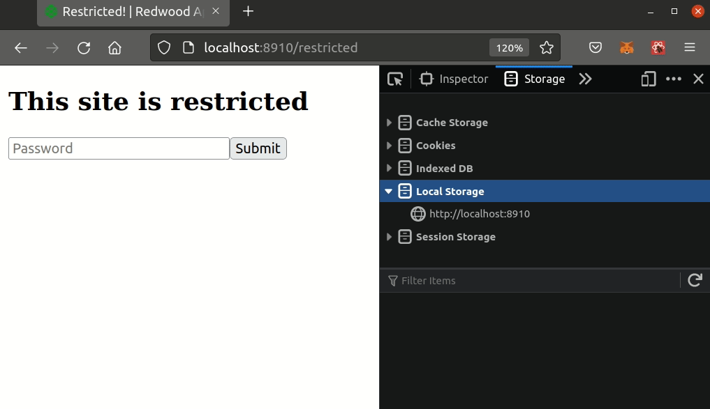

<h1 align="center">Welcome to restricted-redwood-example 👋</h1>
<p>
  <a href="#" target="_blank">
    
  </a>
  <a href="https://twitter.com/pi0neerpat" target="_blank">
    
  </a>
</p>

> Limited access protection, before you reveal your amazing app to the world!

### ✨ [Demo](https://restricted-redwood-example.vercel.app)



## Install

NOTE: Anyone who understands web development could break this in a few minutes. It is meant to provide only **limited access protection**, before you reveal your amazing app to the world!

```sh
yarn install
```

1. Copy over `web/providers` and add the `AllContextProviders` to your `App.js`
2. Copy the page `restricted` and add it to `Routes.js`
3. Add `BASIC_AUTH_PASSWORD` to your `.env`

Run it!

## Usage

```sh
yarn rw dev
```

## Author

👤 **Patrick Gallagher**

- Website: https://patrickgallagher.dev
  - Twitter: [@pi0neerpat](https://twitter.com/pi0neerpat)
  - GitHub: [@pi0neerpat](https://github.com/pi0neerpat)

## Show your support

Give a ⭐️ if this project helped you!

---

_This README was generated with ❤️ by [readme-md-generator](https://github.com/kefranabg/readme-md-generator)_
